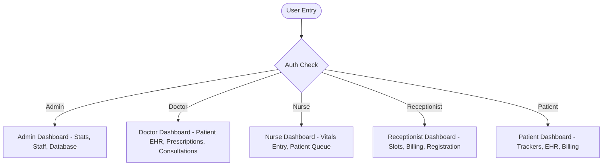

# Project Report: Smart Gynecology Healthcare Management System (BloomCare)

## 1. Introduction
The **Smart Gynecology Healthcare Management System** (BloomCare) is a modern web application built using **Django 5** and **Bootstrap 5** to address specialized clinical needs in obstetrics, gynecology, and women's health. 

Unlike cold, sterile clinical websites that can increase patient anxiety, BloomCare implements a soothing **spa-like organic wellness aesthetic** (creams, warm blush, muted sage, and lavender) with soft curved elements. This design lowers patient anxiety and encourages open communication.

---

## 2. Software Requirements Specification (SRS)

### 2.1 Functional Requirements
- **Authentication & RBAC**: Roles include Administrator, Doctor (Gynecologist), Nurse, Receptionist, and Patient.
- **Appointment Scheduling**: Patients can select slots; receptionists or doctors coordinate check-ins and cancellations.
- **Smart Pregnancy tracker**: Logs LMP, automatically calculates EDD (Naegele's rule), monitors weekly milestones, and matches baby sizes to visual benchmarks (e.g. Raspberry, Avocado).
- **Cycle & Fertility tracking**: Estimates ovulation windows, fertile zones, and predicts upcoming menstruation cycles.
- **Symptom Risk Checker**: An automated checker utilizing safety algorithms to categorize risk levels (Low, Medium, High) and provide immediate recommendations.
- **EHR & E-Prescriptions**: Doctors can record clinical vitals, diagnose conditions, and write digital prescriptions.
- **Laboratory Report Uploads**: Secure uploads for PDFs/images of lab analyses and pelvic ultrasound scans.
- **Billing & Invoicing**: Receptionists or patients can review costs, add taxes, and track checkout completions.

### 2.2 Non-Functional Requirements
- **Security**: Strict role authorization on views and secure hashing of custom admin passwords.
- **Usability**: Responsive layout that scales gracefully onto smartphones.
- **Architectural Clarity**: Decoupled folder structures separating Python files, frontend layouts, SQLite databases, and project document templates.

---

## 3. System Architecture & Workflows

### 3.1 Patient Workflow
1. Patient signs up or logs in.
2. Explores the **Symptom Checker** or logs menstrual cycle to review ovulation forecasts.
3. Submits an **Appointment Request**.
4. Arrives at the clinic: **Nurse** checks them in and logs weight, blood pressure, temperature, and heart rate.
5. **Doctor** logs clinical symptoms, diagnoses, writes an e-prescription, and saves the record.
6. System automatically generates a pending billing invoice.
7. **Receptionist** processes cash/card checkouts, and patient downloads the printable invoice receipt.

---

## 4. Database Schema Design (SQLite Mapping)

The database utilizes nine tables containing relations mapped via Django ORM.

### 4.1 Table Definitions

1. **User (auth_user)**: Extends default Django user with `role`, `phone_number`, `address`, and `gender`.
2. **DoctorProfile**: Links to User. Contains `specialization`, `experience_years`, `consultation_fee`, and `available_hours`.
3. **PatientProfile**: Links to User. Contains `date_of_birth`, `blood_group`, `emergency_contact_name`, `emergency_contact_phone`, and `medical_history_notes`.
4. **Appointment**: Tracks `patient`, `doctor`, `appointment_date`, `time_slot`, and `status` (Scheduled, Checked In, Completed, Cancelled).
5. **PregnancyTrackerLog**: Stores `last_menstrual_period`, calculated `edd`, and progress notes.
6. **MenstrualFertilityLog**: Tracks cycle dates to predict future periods and fertile windows.
7. **MedicalRecord**: Stores vital signs (BP, Temp, Weight), diagnosis, and prescriptions.
8. **LabReport**: Stores upload records for diagnostic PDFs (e.g. Ultrasound scan files).
9. **BillingInvoice**: Handles payment totals, tax amounts, status (Paid/Pending), and payment methods.

---

## 5. Verification & Test Plan

### 5.1 Verification Tests Completed
- **Syntax Validation**: Checked all project files using `python manage.py check`.
- **Database Synchronization**: Successfully generated and applied migrations to `database/db.sqlite3`.
- **Theme Testing**: Verified that css elements load clean, soothing wellness colors.
